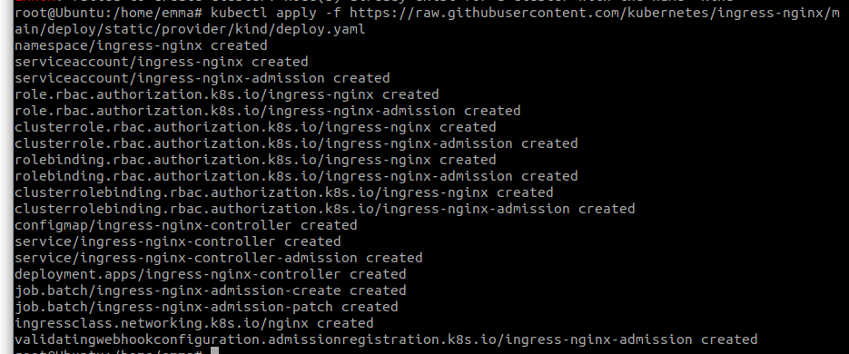
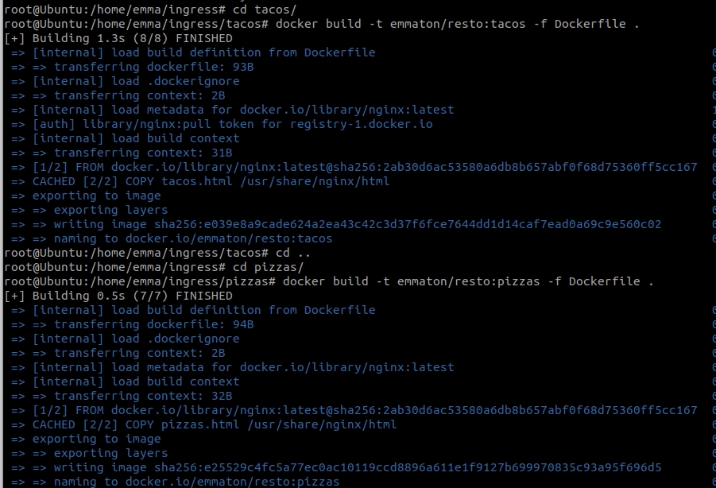
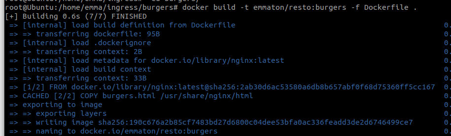
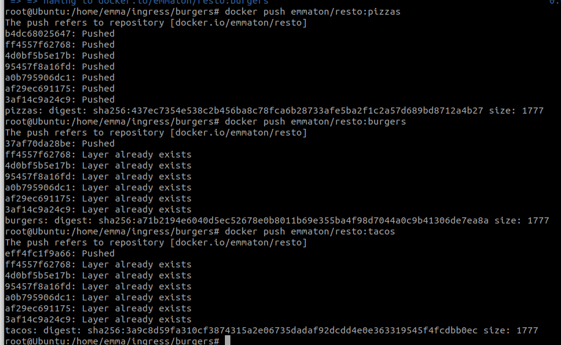
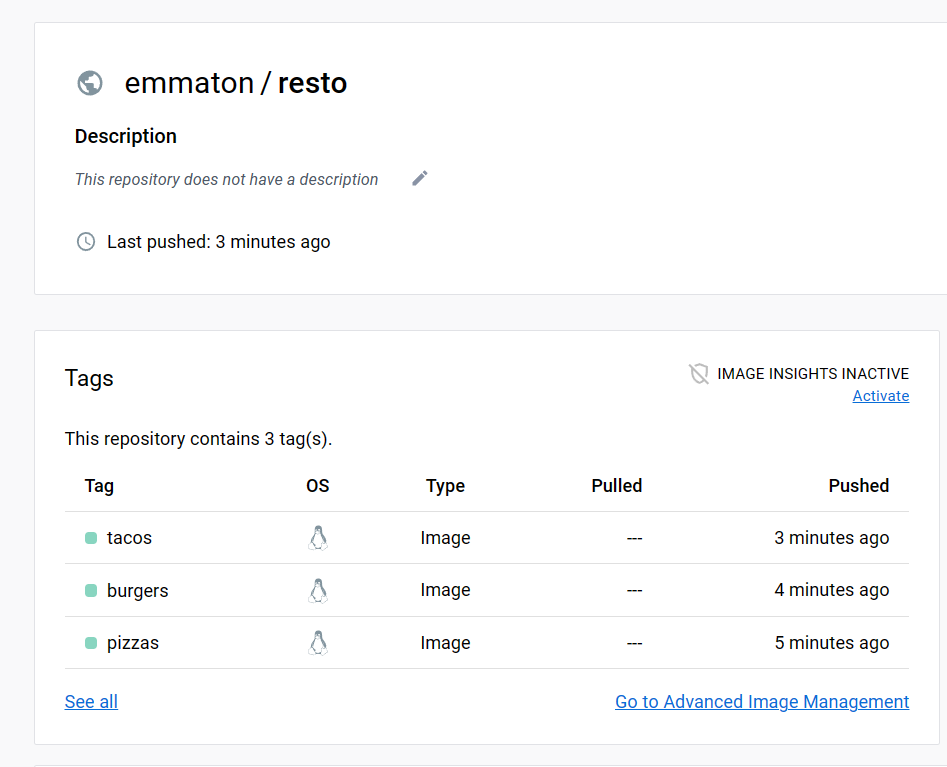
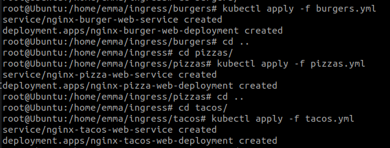
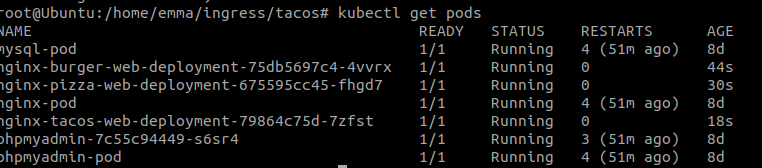

# tp_kubernetes_ingress

## Installer Kind et créer votre premier cluster

### Installer Kind 

```
curl -Lo ./kind https://kind.sigs.k8s.io/dl/v0.17.0/kind-linux-amd64
chmod +x ./kind
sudo mv ./kind /usr/local/bin/kind
```

### Créer votre premier cluster

```
 kind create cluster
```

## Installer le Nginx ingress Controller

```
kubectl apply -f https://raw.githubusercontent.com/kubernetes/ingress-nginx/main/deploy/static/provider/kind/deploy.yaml
```
Résultat : 



## Compléter le schéma suivant avec des objets Kubernetes
Voir le fichier schema.png

## Builder et publier (à partir de l’image nginx) sur le DockerHub, une image docker pour chacun des sites web présent sur le schéma précédent.
Vous devez avoir 3 images (une par magasin tacos, pizzas et burgers)

### Creations de 3 fichiers html
pizzas.html
burgers.html
tacos.html

### Creations de 3 Dockerfile associé à chaque fichier html

### Construction des images

```
docker build -t emmaton/resto:pizzas -f Dockerfile .
docker build -t emmaton/resto:burgers -f Dockerfile .
docker build -t emmaton/resto:tacos -f Dockerfile .
```
Résultat :





### On se connecte à  Docker Hub
```
 docker login --username=emmaton
``` 
### On pousse les images sur Docker Hub
```
docker push emmaton/resto:pizzas
docker push emmaton/resto:tacos
docker push emmaton/resto:burgers
```





## Ecrire les fichiers yaml vous permettant de déployer sur votre cluster kind installé en local les composants décrits sur le schéma de la question 3 
On ecrit les fichiers :

pizzas.yml
burgers.yml
tacos.yml

Et on déploie : 
```
kubectl apply -f tacos.yml
kubectl apply -f pizzas.yml
kubectl apply -f burgers.yml
```



On vérifie : 
```
kubectl get pods
```



## Votre magasin de tacos devient très populaire (il va avoir 3 fois plus de commandes)
Il va vous falloir gérer une charge importante sur le Service de commande des tacos.
Comment gérez-vous cela ? Comment vérifier que les requêtes sont bien réparties
(avec quelle commande kubectl ?) ?

On modifie le replica des tacos à 3 

On applique les mofification
```
kubectl apply -f tacos.yml
```
Et on vérifie
```
kubectl get rs
```
Pour vérifier que les requêtes sont bien réparties on execute :

```
kubectl top
```


## Créer une nouvelle version de votre carte des pizzas et publiez-la dans une nouvelle version de votre image. Appliquer la modification à votre déploiement. Qu’observez vous sur la disponibilité du service qui présente la carte des pizzas pendant la mise à jour ?
